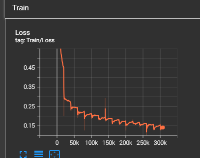
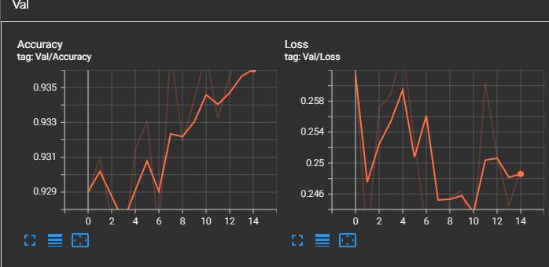
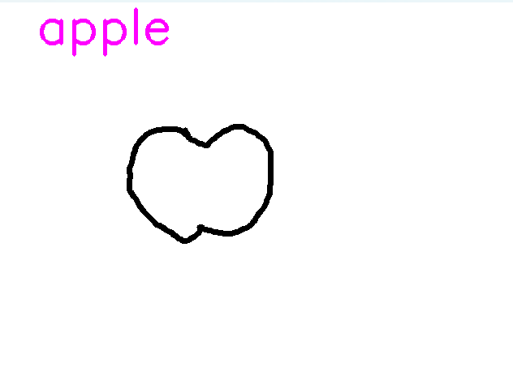
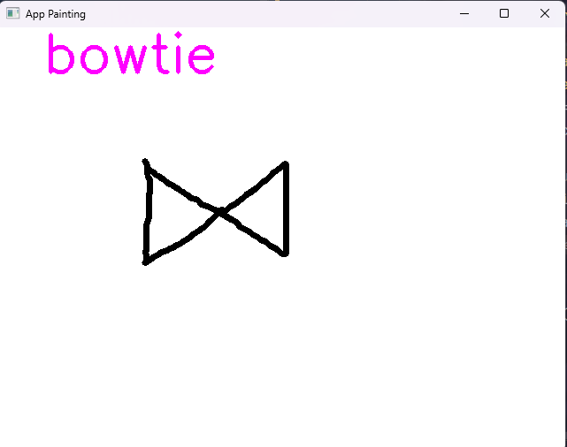
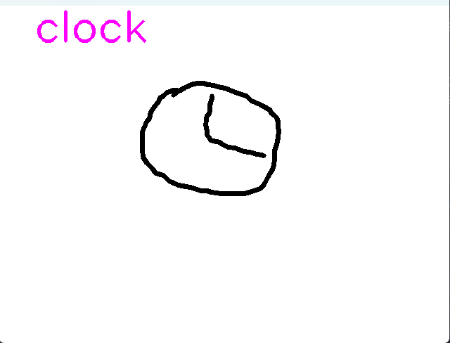

 Quick Draw Recognition<br>
Objective: Develop a system to recognize and classify simple doodles from the Quick Draw dataset using Convolutional Neural Networks (CNN).<br>
Main Components:<br>
  - Model (Model.py): Defines a CNN architecture consisting of Convolutional, BatchNorm, ReLU, MaxPooling, Adaptive Pooling, and Fully Connected layers to process 28×28 grayscale images into class predictions.<br>
  - Image Testing Application (test_image.py): Uses OpenCV and PyTorch to load an image, convert it with ToTensor, and run it through a pre-trained model using a saved checkpint to predict its class.<br>
  - Interactive Drawing Application (app_painting.py): Provides a canvas interface using OpenCV where users can draw with the mouse. The final drawing is cropped, preprocessed, resized to 28×28, and classified using the trained model.<br>
  - Data Processing (dataset.py): Implements a custom PyTorch Dataset that loads and preprocesses images stored in NumPy format to support model training and evaluation.<br>
  - Technology: Python, PyTorch, OpenCV, NumPy, torchvision<br>

Train Tensorboard<br>
<br>

Val Tensorboar<br>
<br>

Demo 1<br>
<br>

Demo 2<br>
<br>

Demo 3<br>
<br>

Install dependencies
```
 pip install -r requirements.txt
```
